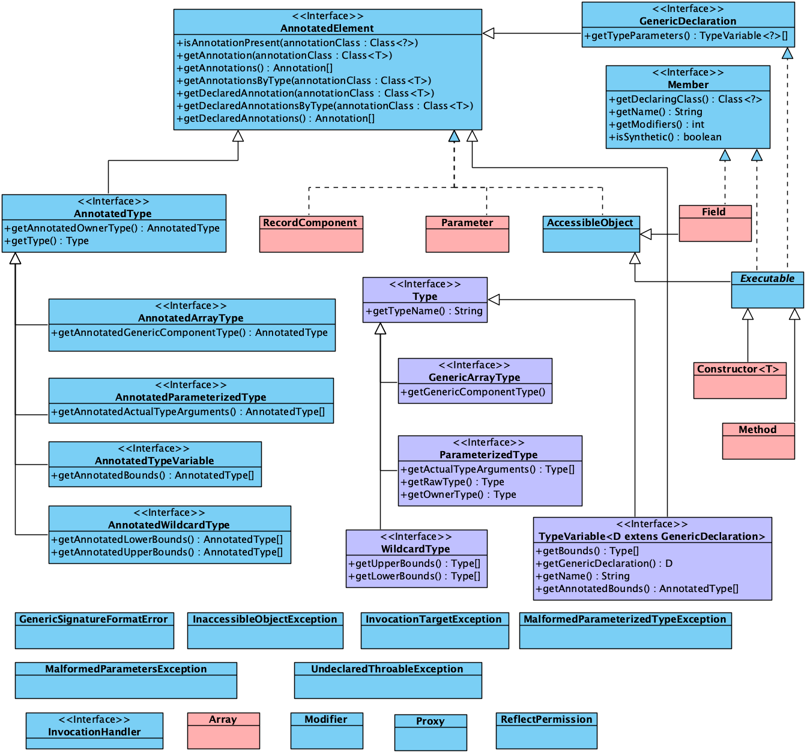

# Java lang reflect package UML




```java
public interface AnnotatedElement {}

public interface AnnotatedType extends AnnotatedElement {}
public interface AnnnotatedArrayType extends AnnotatedType {}
public interface AnnnotatedParameterizedType extends AnnotatedType {}
public interface AnnnotatedTypeVariable extends AnnotatedType {}
public interface AnnnotatedWildcardType extends AnnotatedType {}

public final class RecordComponent implements AnnotatedElement {}
public final class Parameter implements AnnotatedElement {}
public interface Member {}
public class AssibleObject implements AnnotatedElement {}
public final class Field extends AccessibleObject implements Member {}
public interface GenericDeclaration extends AnnotatedElement {}
public abstract class Executable extends AccessibleObject implements Member, GenericDeclaration {}
public final class Constructor<T> extends Executable {}
public final class Method extends Executable {}

public interface Type {}
public interface GenericArrayType extends Type {}
public interface ParameterizedType extends Type {}
public interface WildcardType extends Type {}
public interface TypeVariable<D extends GenericDeclaration> extends Type, AnnotatedElement {}

public class Proxy implements java.io.Serializable {}
public class Modifier {}
public final class Array {}
public interface InvocationHandler {}
public final class ReflectPermission extends java.security.BasicPermission {}
```


## 

