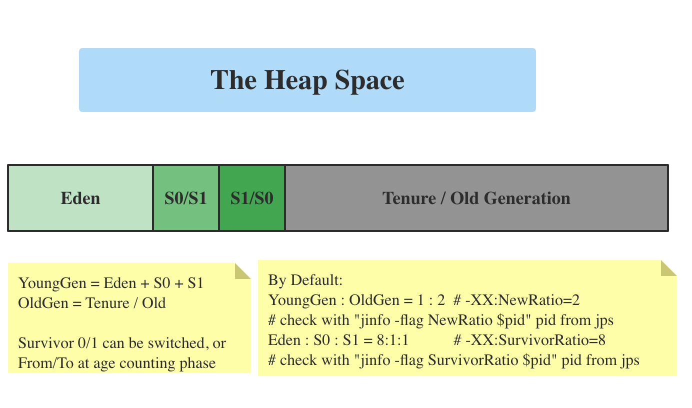
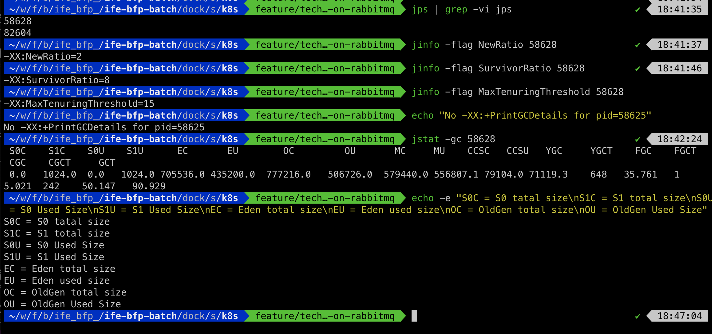
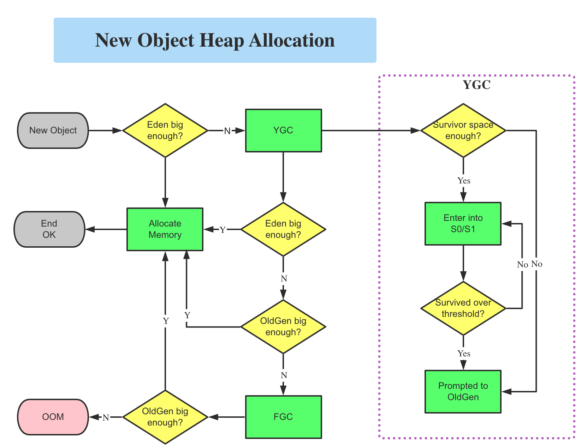

# The Heap Space

- Heap and method area are shared by all threads,
- But method call frame (stack) and PC counter are private to its own thread
- Heap size is default to 1/64 of physical memory size and max size is 1/4 of physical memory
- Built-in tool jvisualvm can visually see Eden, S0, S1, Old Gen, Metasapce, etc clearly
- -Xms10m is the same as -XX:InitialHeapSize   (ms = memory start)
- -Xmx10m is the same as -XX:MaxHeapSize    (mx = memory max)
- Making -Xms = -Xms is to avoid re-allocate/claim heap after GC
- Because 70%-99% objects are temporary, for performance, Hotspot divides heap into 2 Generation: New Gen and Old Gen. Most of objects are discarded at New Gen, after survive n-times (`-XX:MaxTenuringThreshold=15 by default`) YGC, it is promoted to Old Gen. 
- By default, `New Gen Space : Old Gen Space = 1 : 2` by config `-XX:NewRatio=2`
- Young Gen is divided into: Eden, Survivor 0 and Survivor 1 (Mark and Swap), S0 and S1 are switchable based on the free space, both can be from/to area.
- By Default, `Eden : S0 : S1 = 8 : 1 : 1` by `-XX:SurvivorRatio=8`
- **When S0, S1 is full, it won't trigger YGC, but YGC will gc objects in S0, S1 area**, when it survives MaxTenuringThreshold, it is promoted to OldGen area
- When trying to collect S0, S1, the one, which has more free space, will be treated as to-area, i.e. copying another area to this area if object still has reference and its survivor count after adding 1 doesn't reach MaxTenuringThreshold yet, otherwise it will be promoted to OldGen. When alive objects reach half of S0+S1, older survivor object will be  promoted to OldGen even it doesn't; reach the threshold age yet
- Built-in tool: `jinfo -flag NewRatio $PID_FROM_JPS` to see the values of these flags
- Or Built-in too: `jstat gc #PID_FROM_JPS` to show the runtime status of java process memory. It will have more information when starting java with `-XX:+PrintGCDetails`





# New Object Memory Allocation



# Memory Measuring

```java
-Xms600m -Xmx600m

final long ONE_M = 1024 * 1024;
long initialMemory = Runtime.getRuntime().totalMemory() / ONE_M;		
long maxMemory = Runtime.getRuntime().maxMemory() / ONE_M;					
System.out.printf("-Xms=%dM -Xmx=%dM", initialMemory, maxMemory);		// -Xms=575M -Xmx=575M  why???
```

- Because when counting, it will only count on Eden + one of survivor areas (either s0 or s1, not both) + OldGen
- By Default, NewGen : OldGen = 1 : 2, so NewGen = 200M, OldGen = 400M in this case
- And because, Eden : S0 : S1 = 8 : 1 : 1, so Eden = 160M, S0 = S1 = 20M
- So total memory = OldGen + Eden + Either S0 or S1 = 400 + 160 + 20 = 580M (around 575M). Where is other 5M, memory alignment (my logical guess)

# GC

## Partical GC (Minior GC / Young GC)

## Full GC (Major GC / Old GC)

## Mixed GC 

- GC the whole NewGen and portion of OldGen. Only G1 GC does this since it has region, and inside region, it has NewGen and OldGen

## When to trigger YGC

- When there are no enough spaces in Eden area, it will trigger Minor GC. For Survivor area, even it is full, it won't trigger YGC. But YGC will gc survivor area objects, i.e. pasitively)
- Because most of objects are local variables, YGC will be very frequent and is fast
- YGC will cause STW (Stop The World), all user threads pause to wait until YGC is finished

##  When to trigger OGC

- Major GC is 10 times slower than Minor GC, STW will be longer, it will annoy the user, thinking server is dead
- Normally Major GC will also trigger YGC
- After Mjar GC, if still no enough memory, it will throw OOM
- Calling System.gc will suggest system to run Full GC, but it may not happen since it is just a suggestion although most of time, it will happen
- When OldGen has no enough free space
- When Method Area has no enough free space (MetaSpace)
- From Eden, S0 (From-Area) to S1 (To-Area), if object size is too big to fit inside S1, it will go to OldGen directly, but OldGen has no enough free space to fit this big object either, it will trigger FGC

### Reference

[JVM Memory - Heap](https://mp.weixin.qq.com/s/kvNzUl4ClCMIEVzUv_TTmA)

