# Basic

## OSI Model

From bottom to top, it can be abbreviated as: **P**lease **D**o **N**ot **T**hrow **S**ausage **P**izza **A**way

- A = Application Layer
- P = Presentation Layer
- S = Session Layer  **Above can be grouped as application, depending on protocol**
- T = Transportation Layer
- N = Network Layer
- D = Data link Layer
- P = Physical Layer

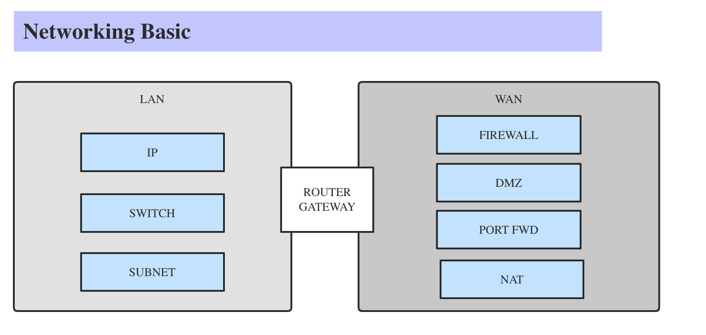

* Hub and switch are used for LAN computers, their differences are:
  * When hub sends packets, every other computers on the same hub will receive physically (not UDP protocol)
  * On the other hand, switch will send packet peer to peer even on the same switch
* When crossing different LANs, it needs router / gateway

## IPv4

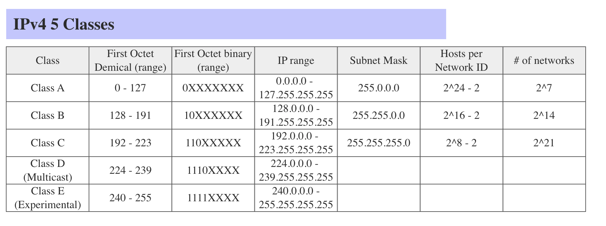

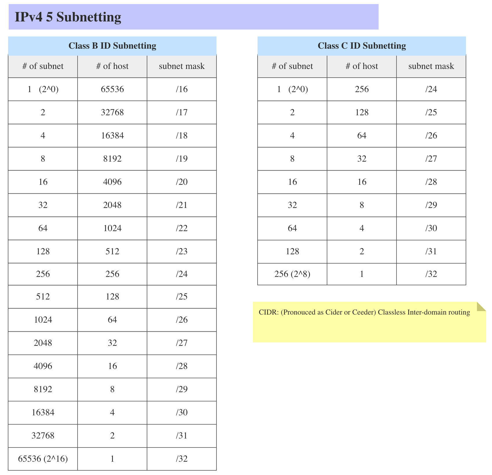

# Common Protocol

## ICMP

### Ping Utils

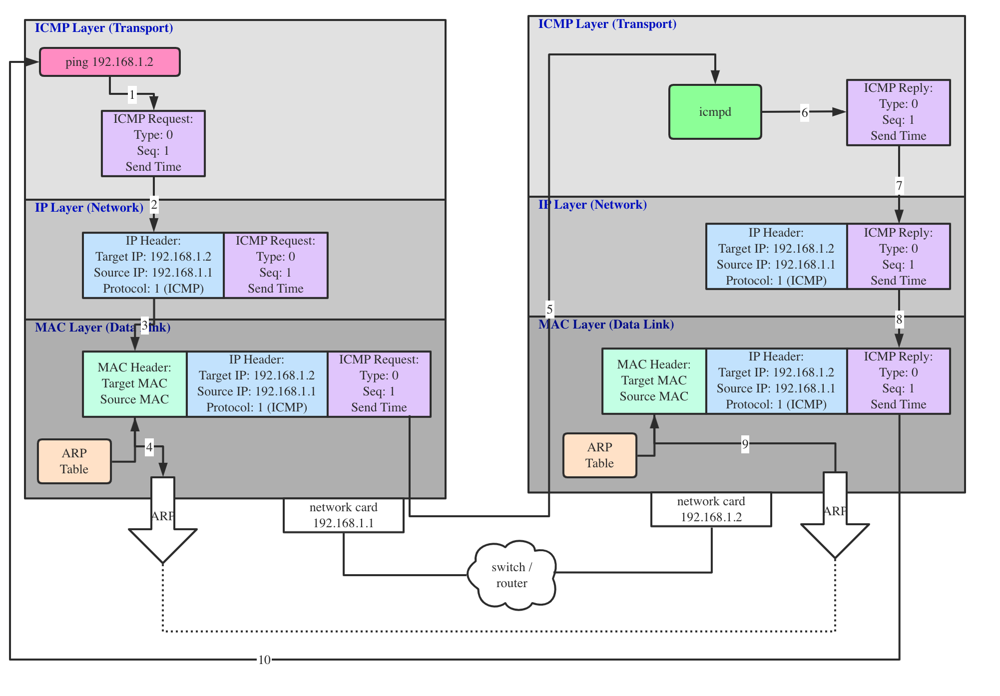

### Traceroute or tracrt utils

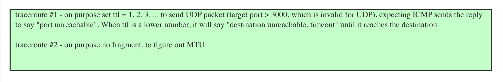

## DNS

### DNS Query

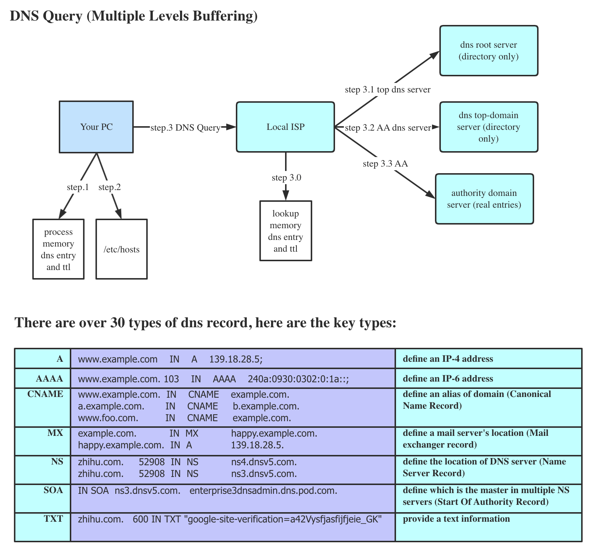

## DHCP

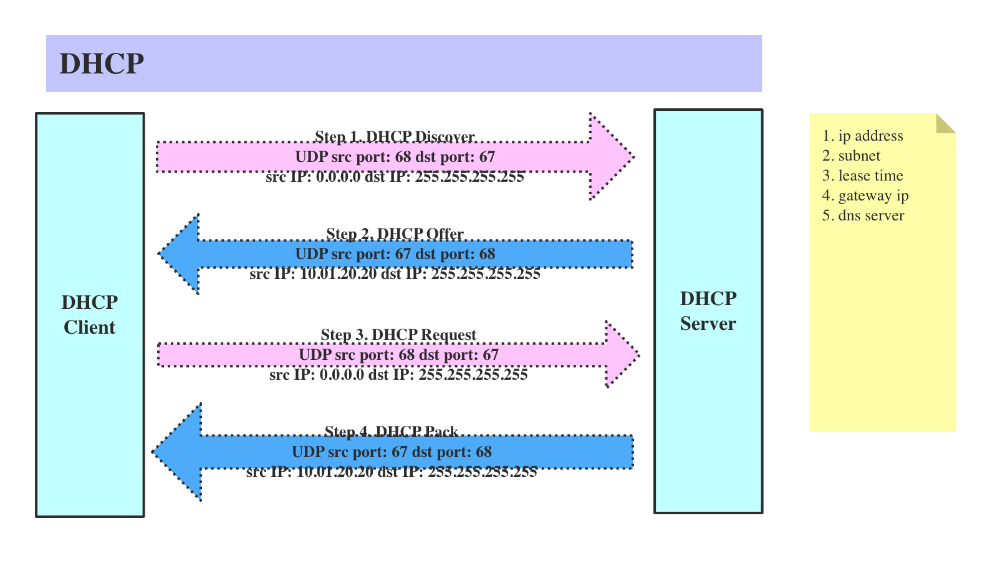

## HTTP/HTTPS

### TCP connection 3 hand-shaking and 4 hand waving (Up to Layer 4 for establishing connection)

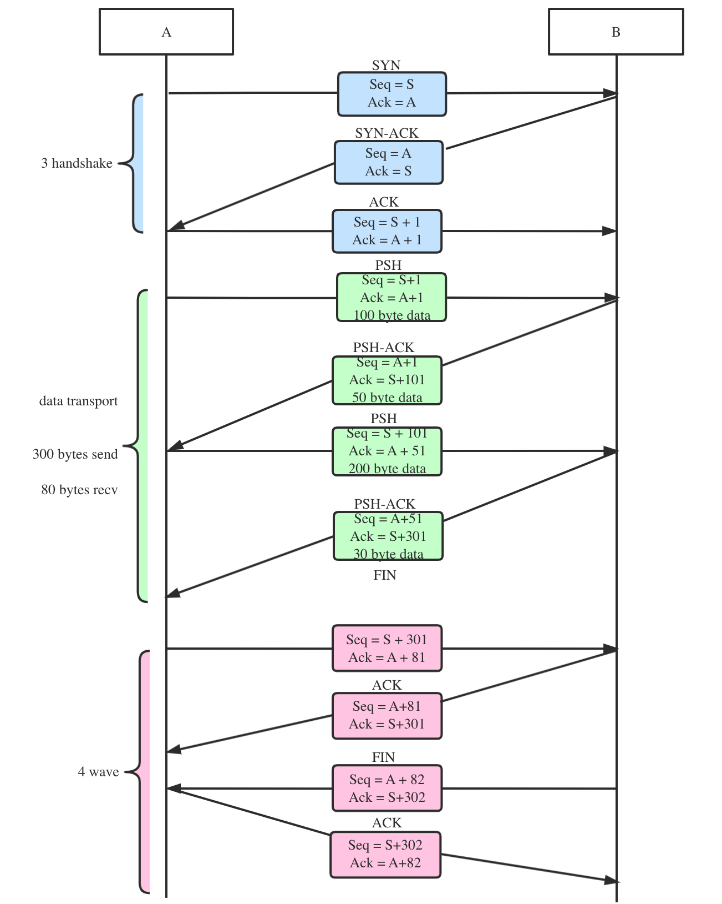

### TCP Header 

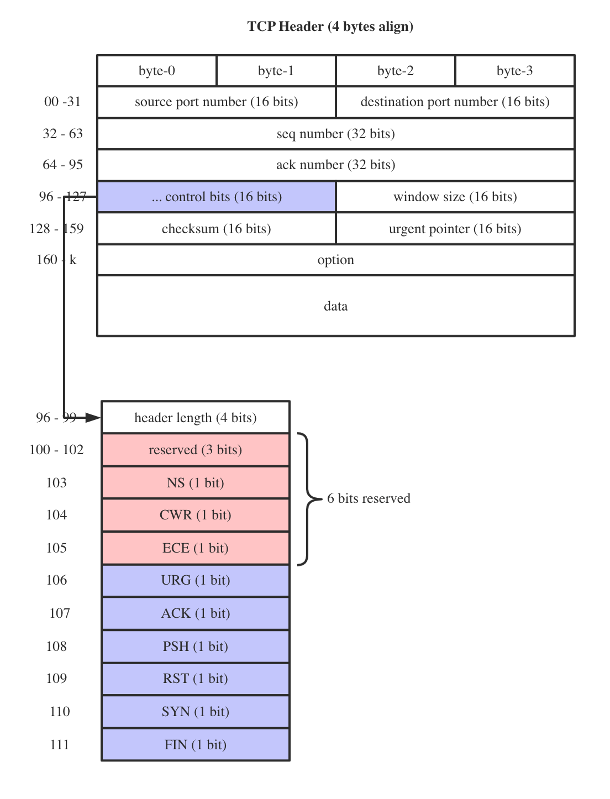

### HTTP CORS

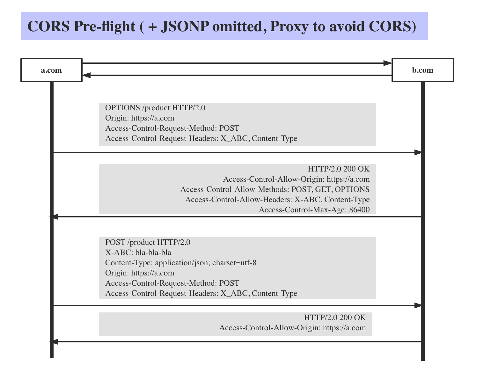

### HTTPs connection

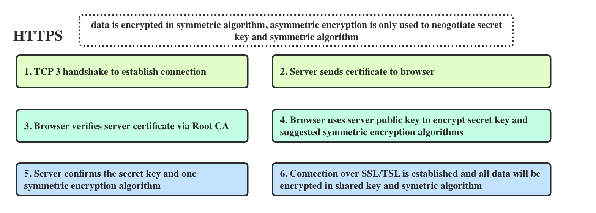

### HTTPs certificate chain

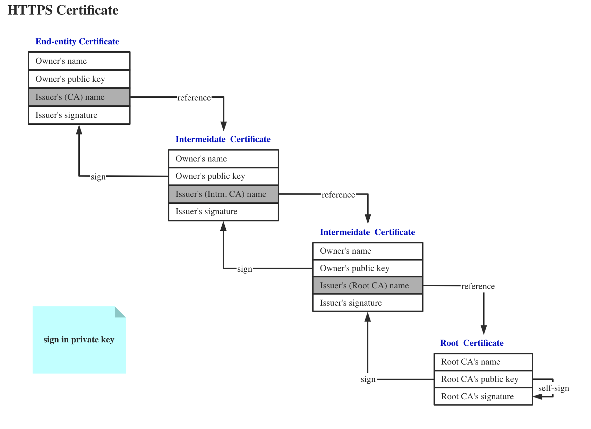

# Java Networking

## Java Block IO

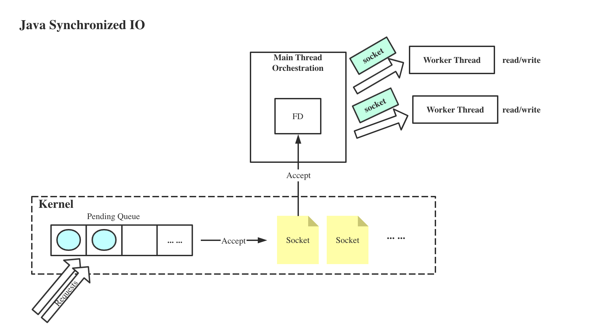

## Java New IO

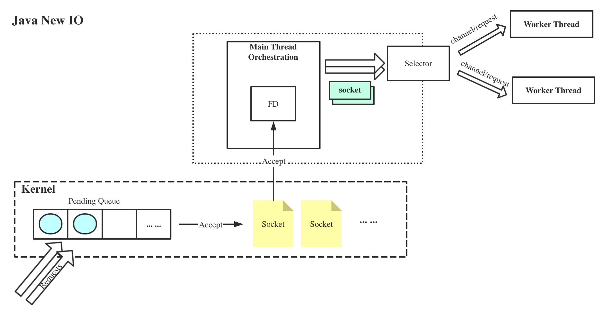

# Docker Networking

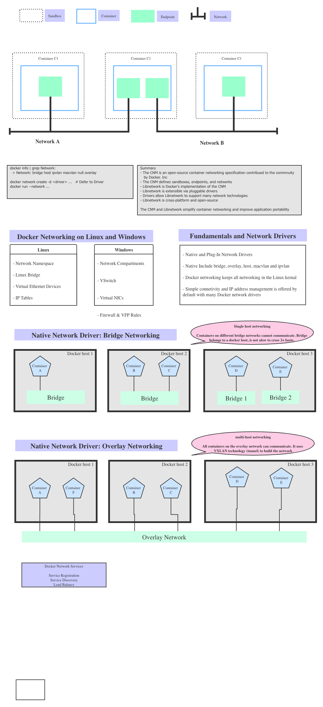

# Kubernetes Networking

## how a pod get IP address

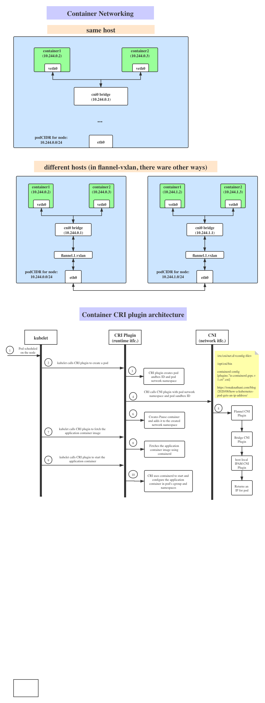

