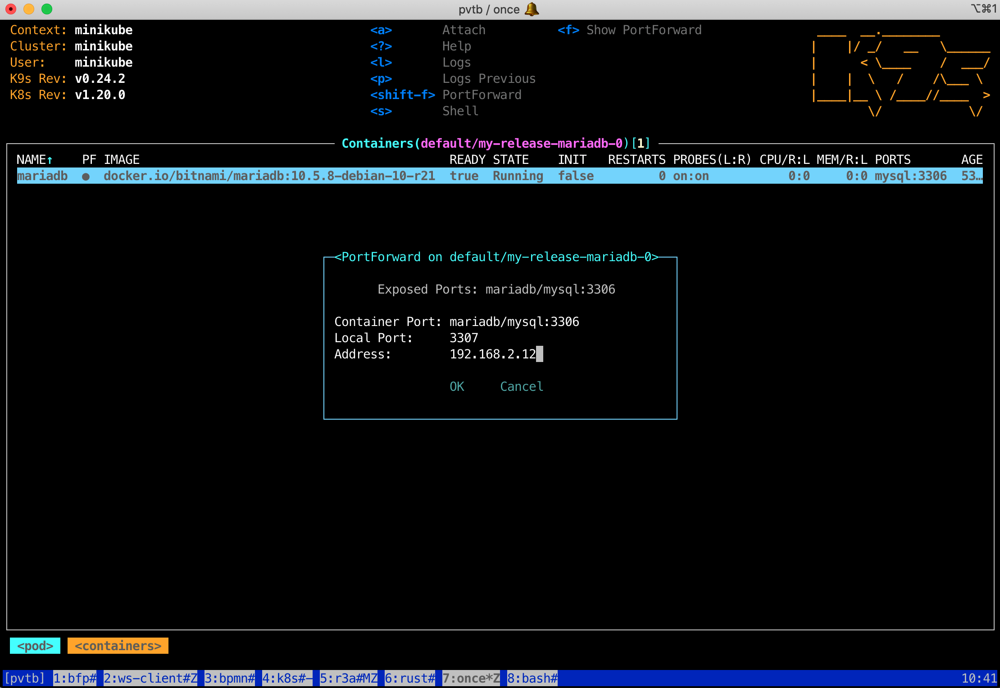
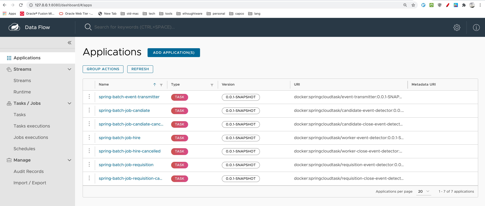
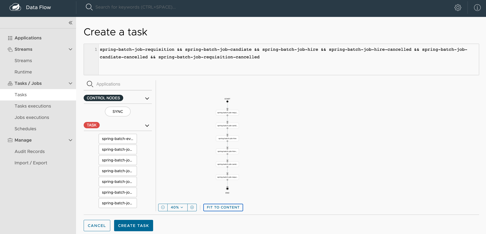
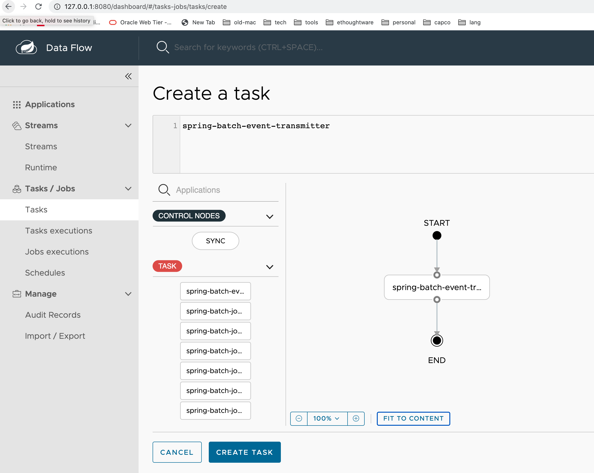
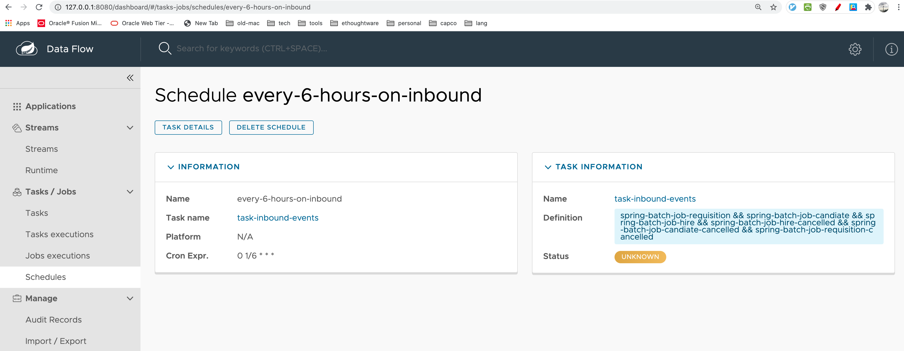
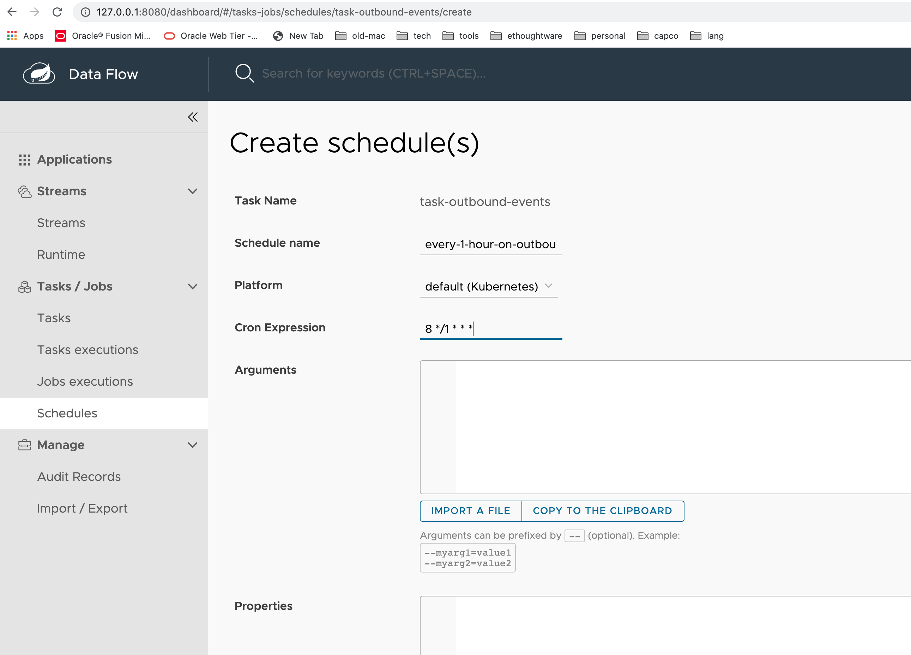

# Creating a Cluster

```shell
minikube start --cpus=4 --memory=8192

# if already created and want to start over
# minikube stop
# minikube delete
```

# Install Spring Cloud Data Flow in Helm

```shell
# add helm repository
helm repo add bitnami https://charts.bitnami.com/bitnami

# install dataflow server
helm install my-release bitnami/spring-cloud-dataflow
# default helm chart uses RabbitMQ and MariaDB 
# to customize, check https://github.com/bitnami/charts/tree/master/bitnami/spring-cloud-dataflow
# after customization, dataflow server and skipper server may need to be re-built with required libraries

# to uninstall after done
# helm uninstall my-release
```

# Launch Dashboard

```shell
export SERVICE_PORT=$(kubectl get --namespace default -o jsonpath="{.spec.ports[0].port}" services my-release-spring-cloud-dataflow-server)
kubectl port-forward --namespace default svc/my-release-spring-cloud-dataflow-server ${SERVICE_PORT}:${SERVICE_PORT} & 
echo "http://127.0.0.1:${SERVICE_PORT}/dashboard"
```

Note: port-forward must keep running, that is why it must be run at the background

type the echo text into chrome browser

# Deploy Your App Database DDL and RefData

Since the above step uses *bitnami/mariadb* which deploys `my-release-mariadb` at 3306 of its container, a port-forward is needed for external client to access, such as MySQL Workbench, Liquibase deployment, etc.

1. Expose internal database to external access

```shell
# launch k9s
k9s

# select my-release-mariadb-0 then <shift-f> to forward to host-ip and a port, such as: 192.168.2.12:3307
```



2. Deploy your own application DDL

```shell
# mvn liquibase:update
# gradle update

# Or directly liquibase update
liquibase --defaultsFile=liquibase-on-spring-cloud-dataflow-mariadb.properties update
```

# Deploy Your Spring Batch App by Using Data Flow

1. Build docker image under minikube's docker-daemon

```shell
# point shell to minikube's docker-daemon
eval $(minikube docker-env)

# verify there are no springcloudtask/${your-app-names} images 
# docker images | grep springcloudtask

# build docker image using jib maven/gradle plugin
./mvnw clean package jib:dockerBuild
# --- or no unit tests
./mvnw clean package jib:dockerBuild -DskipTests

# verify there are springcloudtask/${your-app-names} images 
# docker images | grep springcloudtask

```

2. Registering under Kubernetes using docker: protocol

```shell
# deploy the above springcloudtask/{apps} via spring cloud dataflow dashboard http://.../dashboard
applications -> Add application(s) -> Register one or more apps 
-> Type: task
-> Uri:  docker:<docker-image-path>/<imageName>:<version>
```

3. Have a plan to unify all #2 deployed application names and next section to-be-created task names, e.g.
   - Application name will start with spring-batch-...
   - Task name will start with task-...



# Create Tasks 

1. Create tasks by weaving deployed spring-batch applications together

```shell
Tasks/Jobs -> Tasks -> Create Task
drag drop all required spring-batch applications as task-steps
```

e.g.



naming it as "task-inbound-events"



naming it as "task-outbound-events"

2. Schedule all tasks based on cron syntax for each tasks

Go to Tasks / Jobs -> Tasks list page

- click '...' Icon at left side of "task-inbound-events", then select Schedule action to schedule to run every 6 hours



- click '...' Icon at right side of "task-outbound-events", then select Schedule action to schedule to run every 1 hours




