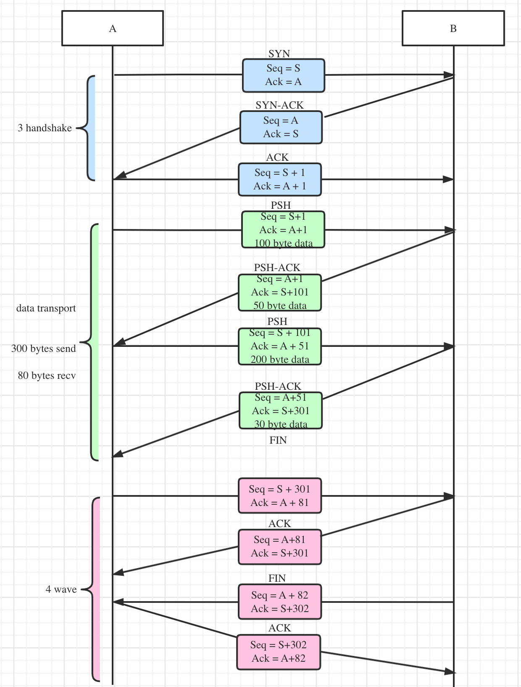
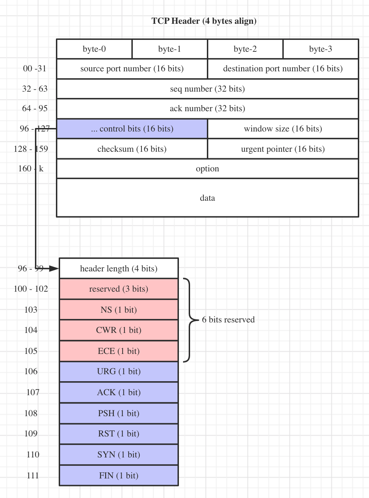

## TCP

Each connection will has 3 handshake, n data transportations and 4 wave. See 

Because application layer data can be big, it is divided into n segments, each segment will add TCP Header, whose diagram will be: 