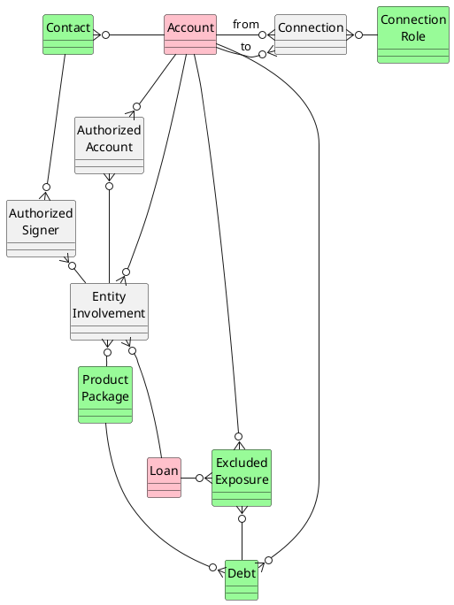

## High-Level Overview
A Relationship is typically a customer, client, member or application, but could also be a  Center of Influence, vendor, 
etc. They hold all the important information about an entity the financial institution wants to do business with. nCINO
uses Salesforce's Account standard object, relabelled to Relationship, and adds additional fields to create 
the data set needed to power its banking operating system. nCino divides relationships into 4 categories: 
* Individuals 
* businesses
* lenders 
* households 
## Data Model
The main objects are `Account` and `Loan`. The supporting objects are `Contact` and `Connection` Role. 
The junction objects are `Connection`, `Authorized Account`, `Authorized Signer` and `Entity Involvement`.

## Terminology
### Connection Role
A connection contains two parts: The **Connecting From** relationship and the **Connection To" relationship 
and describes the nature of the connection.
### Reciprocal Role
When the user assigns a reciprocal role, the connected entity is always assigned a related role. Examples of reciprocal
roles include the following: Owner and Company, Co-Owner and Company, Parent and Child, Employer and Employee, 
and Service Provider and Client.
### Self-Reciprocating Role
Self-Reciprocating Roles are the result of both connected entities being assigned the same role. Examples of 
Self-Reciprocating roles include the following: Connection, Colleague, Competitor, Friend, Life Partner, Sibling, 
Spouse, and Subsidiary.

